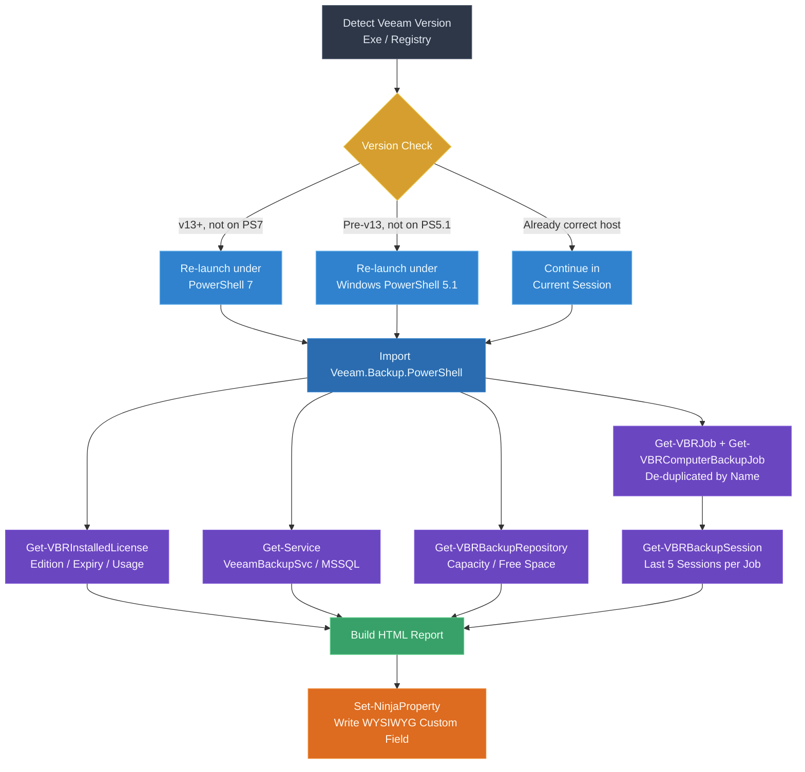

# Veeam Status Report for NinjaOne

A PowerShell discovery script that generates a rich, styled HTML status report for Veeam Backup & Replication and publishes it into a NinjaOne custom field, giving techs an at-a-glance view of licensing, services, repositories, and job history directly in the NinjaOne dashboard.

[](https://github.com/PowerShell/PowerShell)
[](https://github.com/dean-johnson/veeam-ninjaone-report/releases)
[](LICENSE)

## Example Output

<p align="center">
  
  <br>
  <em>Example of the generated HTML report as it appears in a NinjaOne WYSIWYG custom field</em>
</p>

> **Tip:** filenames with square brackets (like `example[1].jpg`) need to be URL-encoded in Markdown (`%5B` / `%5D`) to render reliably everywhere. If you'd rather avoid that, simply rename the file to something like `images/example-output.jpg` and update the path above — GitHub, most editors, and static site generators are all happier without brackets in image filenames.

## Overview

This script runs locally on a Veeam Backup & Replication server, gathers license, service, repository, and job data via the Veeam PowerShell module, and renders it as a single HTML report. The report is pushed to a NinjaOne WYSIWYG custom field using `Set-NinjaProperty`, so the current backup posture is visible without opening the Veeam console.

## Architecture



### Key Features

- **Version-Aware Host Selection**: Detects the installed Veeam version and automatically re-launches under PowerShell 7 (Veeam v13+) or Windows PowerShell 5.1 (pre-v13) as required
- **License Monitoring**: Reports edition, expiration date, instance usage, and a color-coded countdown to license expiry
- **Service Health**: Checks core Veeam and SQL services and reports their running state
- **Repository Capacity**: Lists all backup repositories with free/total space and percentage free, with safe fallback for object/cloud repositories that report 0 capacity
- **Job History & Success Rate**: De-duplicates job listings (standard + agent-based jobs), shows last result, duration, a visual success-rate bar, and the last 5 sessions per job
- **Self-Contained HTML Output**: No external assets — a single styled HTML table designed to render cleanly inside a NinjaOne custom field

## Prerequisites

### NinjaOne Custom Fields (Required)

| Field Name | Type | Access | Description |
|------------|------|--------|-------------|
| `veeamJobStatus` | WYSIWYG | Write | Stores the generated HTML report (name configurable via parameter) |

### Veeam Requirements

- Veeam Backup & Replication installed locally on the host the script runs on
- `Veeam.Backup.PowerShell` module available (installed alongside Veeam B&R)
- Account running the script must have permissions to query Veeam via PowerShell (typically run as SYSTEM/local admin via NinjaOne agent)

### PowerShell Requirements

- Windows PowerShell 5.1 for Veeam v12 and earlier
- PowerShell 7 for Veeam v13+ (script auto-relaunches under the correct version if available; falls back to the current session if the other version isn't installed)

## Installation

1. **Download the script**:
   ```powershell
   Invoke-WebRequest -Uri "https://raw.githubusercontent.com/dean-johnson/veeam-ninjaone-report/main/VeeamPull.ps1" -OutFile "VeeamPull.ps1"
   ```

2. **Create the NinjaOne custom field**:
   - Add a **WYSIWYG** type custom field (default name: `veeamJobStatus`)
   - Grant **Write** access to the role/script that will run this report

3. **Create a NinjaOne script**:
   - Upload `VeeamPull.ps1` as a script
   - Assign it to Veeam backup servers, with custom field write access
   - Run on a schedule (e.g., hourly or after backup windows)

## Configuration

### Script Parameters

| Parameter | Type | Default | Description |
|-----------|------|---------|-------------|
| `cfVeeamJobStatus` | String | `veeamJobStatus` | Name of the NinjaOne WYSIWYG custom field to write the report to |
| `cfUsbLabel` | String | `""` | Reserved for future use |

### Usage

```powershell
# Run with default custom field name
.\VeeamPull.ps1

# Write to a differently named custom field
.\VeeamPull.ps1 -cfVeeamJobStatus "veeamStatusHtml"
```

The script is designed to run in NinjaOne's agent context (as SYSTEM), where `Set-NinjaProperty` is available natively. It can also be run interactively on a Veeam server for testing, though the custom field write will only succeed inside a NinjaOne-managed session.

## Report Contents

The generated HTML report includes three sections:

1. **System Overview** — Veeam version, license edition/expiry/usage with a color-coded days-remaining indicator, and the status of critical services (`VeeamBackupSvc`, SQL-related services)
2. **Backup Repositories** — name, type, path/host, and free/total capacity for each repository (object/cloud repositories that don't report capacity show `N/A`)
3. **Job Status** — one row per unique job (standard and agent-based jobs de-duplicated by name), showing last result with an icon (✅ Success, ⚠️ Warning, ❌ Failed, 💤 Disabled), last duration, a visual success-rate bar based on the last 5 sessions, and inline session history

## Version Handling

The script checks the installed Veeam version (via the service executable or registry) and ensures it runs under the correct PowerShell host:

- **Veeam v13+**: re-launches under PowerShell 7 (`C:\Program Files\PowerShell\7\pwsh.exe`) if not already running under it, since `Get-VBRInstalledLicense` requires the newer module
- **Veeam v12 and earlier**: re-launches under Windows PowerShell 5.1 if not already running under it

If the target PowerShell host isn't installed on the machine, the script continues in the current session rather than failing outright.

## Troubleshooting

### Common Issues

- **Report shows "Unknown" for license fields** — `Get-VBRInstalledLicense` failed or returned no data; verify the Veeam PowerShell module is loaded and the script has sufficient permissions
- **Repositories show "N/A (Object/Cloud)"** — expected behavior for object storage/cloud repositories that don't expose capacity via `GetContainer()`; this is not an error
- **Custom field not updating in NinjaOne** — confirm the field is type **WYSIWYG** and the running role/script has **Write** access
- **Script re-launches in a loop or exits unexpectedly** — check that both PowerShell 5.1 and PowerShell 7 are installed as expected for the detected Veeam version

## Version History

### v5.7 (Current)
- Fixed backup repository capacity reporting showing 0 GB / 0 GB for certain repository types
- Added safe fallback capacity calculation for pre-v11-style repository objects

### Earlier versions
- Added Veeam v13 licensing support via `Get-VBRInstalledLicense`
- Added version-aware host selection (auto re-launch under PS5.1 or PS7)
- Added job de-duplication across standard and agent-based backup jobs

## Contributing

Contributions are welcome! Please:

1. Fork the repository
2. Create a feature branch
3. Test against a real Veeam server (both pre-v13 and v13+ if possible)
4. Submit a pull request with a detailed description

## License

This project is licensed under the MIT License - see the LICENSE file for details.

## Author

Dean Johnson

## Acknowledgments

- Veeam PowerShell module documentation
- NinjaOne API and custom field documentation
- PowerShell community for best practices and optimization techniques

---

**Note**: This script must run locally on a Veeam Backup & Replication server with the `Veeam.Backup.PowerShell` module available. It is intended for use as a scheduled NinjaOne script rather than manual execution.
